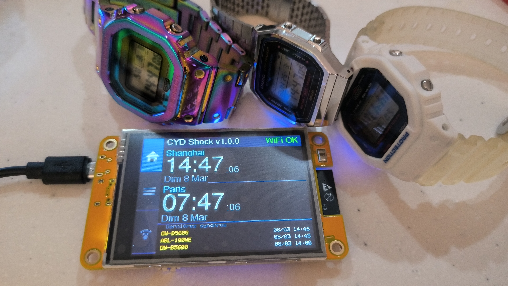

# CYD Shock

BLE time synchronization server for G-Shock / Edifice / ProTrek watches, running on the **ESP32-2432S028** ("Cheap Yellow Display") — 2.8" ILI9341 320×240 TFT + XPT2046 touch, built with PlatformIO / Arduino framework.


---



## Demo

[](https://youtu.be/v-EeG2gj7ZY)

## Credits

All the real work is in **[gshock-api-esp32](https://github.com/izivkov/gshock-api-esp32)** by Ivo Zivkov (MIT) — this is where the G-Shock BLE protocol was reverse-engineered and implemented. CYD Shock is just a wrapper: it adds a display, a touch UI, and WiFi/NTP on top of that core protocol.

---

## Features

- Automatically scans for G-Shock watches over BLE and sets the time
- Dual timezone display (configurable IANA timezones)
- Sync history: last 10 synchronizations persisted to flash
- WiFi + NTP for accurate time source
- In-app WiFi / timezone configuration via captive portal (no recompile needed)
- Each watch uniquely identified by model + last 2 MAC bytes (e.g. `GW-B5600  #A1B2`)

## Hardware

| Component | Details |
|-----------|---------|
| Board | ESP32-2432S028 ("Cheap Yellow Display") |
| Display | ILI9341 2.8" 320×240 (HSPI) |
| Touch | XPT2046 (VSPI) |
| Connectivity | BLE + WiFi (ESP32 built-in) |

## Screens

```
+---------------------------------------+----+
|  Header: app name + WiFi signal       |    |
+---------------------------------------+ H  |
|  Timezone 1: city + time (80px)       | O  |
+---------------------------------------+ M  |
|  Timezone 2: city + time (80px)       | E  |
+---------------------------------------+    |
|  Last 3 syncs                         | L  |
+---------------------------------------+ I  |
                                        | S  |
                                        | T  |
                                        |    |
                                        | W  |
                                        | I  |
                                        | F  |
                                        | I  |
+---------------------------------------+----+
       content (280px)            sidebar (40px)
```

- **SCR_MAIN** — dual timezone clock + recent sync history
- **SCR_LOG** — full sync history (10 entries)
- **SCR_PORTAL** — WiFi AP configuration portal

Sidebar navigation (left 40px): tap **HOME**, **LIST**, or **WIFI**. Long press on content area → back to main screen.

## Getting Started

### 1. Install dependencies

[PlatformIO](https://platformio.org/) is required. Libraries are declared in `platformio.ini` and fetched automatically:

- `LovyanGFX` — display + touch driver
- `ArduinoJson` — config / log JSON parsing
- `NimBLE-Arduino` — BLE stack

### 2. Configure WiFi and timezones

Copy `data/config.json.example` to `data/config.json` and fill in your settings:

```json
{
  "wifi_ssid":     "YourSSID",
  "wifi_password": "YourPassword",
  "timezone":      "Europe/Paris",
  "timezone2":     "Asia/Shanghai"
}
```

Timezones use IANA names. Supported values are listed in `ianaToposix()` in `src/main.cpp`.

### 3. Flash

```bash
# Flash firmware + filesystem
pio run --target upload
pio run --target uploadfs

# Serial monitor (115200 baud)
pio device monitor
```

### Reconfigure without reflashing

Tap the **WIFI** button on the sidebar. The board starts a WiFi access point:

- **SSID:** `CYD-Shock-Config`
- Open `http://192.168.4.1` in your browser to update WiFi credentials and timezones.

## BLE Protocol

Inspired by [gshock-api-esp32](https://github.com/izivkov/CasioGShockSmartSync) (MIT © Ivo Zivkov).

1. BLE scan → advertisement UUID `0x1804`
2. GATT connection to service `26eb000d-b012-49a8-b1f8-394fb2032b0f`
3. Subscribe to notifications on `ALL_FEATURES`, `DATA_REQUEST`, `CONVOY`
4. Button read (`0x10`) → DST states read-echo (`0x1D`) → DST cities read-echo (`0x1E`) → world cities read-echo (`0x1F`) → write time (`0x09`)

The BLE task runs on **core 0**; the display loop runs on **core 1**.

## Project Structure

| File | Role |
|------|------|
| `src/main.cpp` | Screen state machine, display, touch, loop |
| `src/gshock_ble.h/.cpp` | BLE scan + G-Shock protocol (FreeRTOS task, core 0) |
| `src/activity_log.h/.cpp` | Sync history, persisted to LittleFS (`/log.json`) |
| `src/app_config.h/.cpp` | Load/save `/config.json` from LittleFS |
| `src/config.h` | CYD pin assignments, timing constants, screen layout |
| `src/version.h` | `APP_NAME`, `APP_VERSION`, `APP_URL` |
| `data/config.json.example` | Configuration template |

## License

MIT
